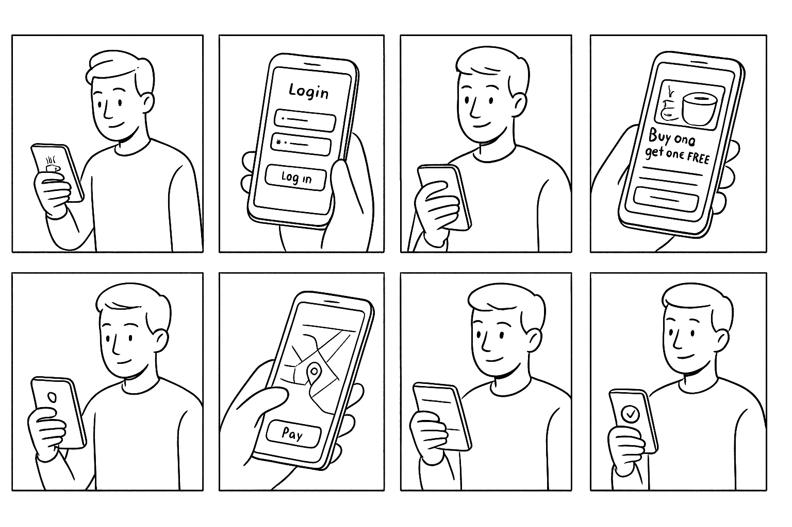
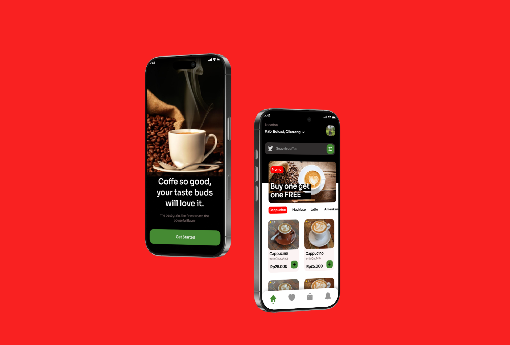
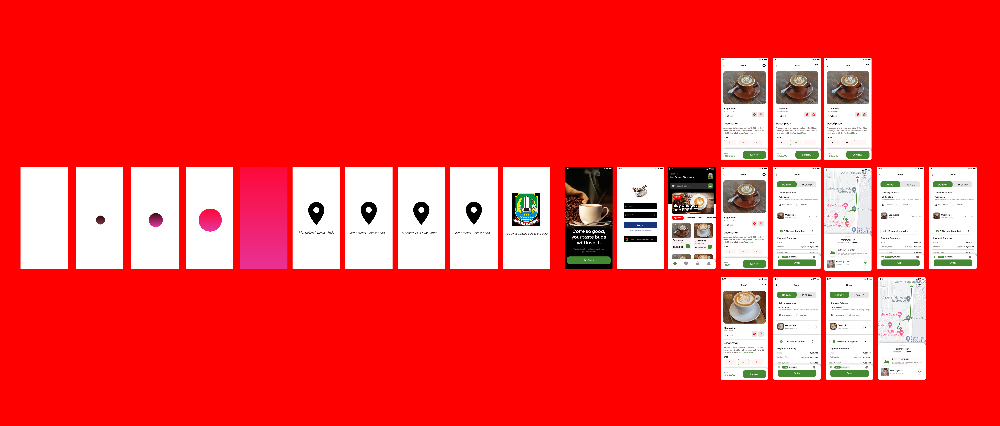

# Splash Screen (Deteksi location, Bendera/logo pemda, Say Hello sesuai lokasi daerah masing-masing)

# Storyboard Project

# Mockup Project

# UI (User Interface) Project

# UX (User Experience) VIDEO PROTOTYPE Project

